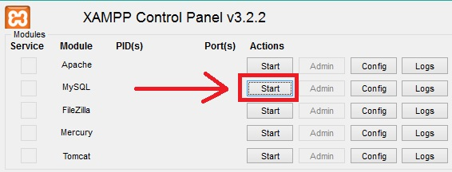

Optimize Prime
--------------
Our homepage can be found here:  
<a href="http://foodtruckop.com" target="_blank">http://foodtruckop.com</a>

Overview
--------
Optimize Prime's project to put all your food truck needs in one place! If you feel the need to satisfy your food truck cravings, you can use our web service to find food trucks that can do just that.

Want that delicious Korean fusion or the ice cream in plant pots that hits the right spot? Look no more!

Authors
-------
* [Adrian Cuellar](https://github.com/AACuellar96)
* [John Wang](https://github.com/johnHaloWang)
* [Rachel Chiang](https://github.com/raechiang)
* [Todd Nguyen](https://github.com/toddnguyen47)
* [Allen Artoonian](https://github.com/asartoonian)

Environment Setup
-----------------
1. Install the latest [Maven](http://maven.apache.org/download.cgi).
2. Install the latest [Eclipse](http://www.eclipse.org/).
3. Make sure your Eclipse has Maven installed (It should have been included in the latest version of the Eclipse)
4. Install a MySQL Server. We recommend installing [XAMPP](https://www.apachefriends.org/index.html) for easy MySQL setup and execution.

Importing the Project into Eclipse
----------------------------------
1. File &rightarrow; Import &rightarrow; Maven &rightarrow; Existing Maven Projects
2. Select the directory containing the pom.xml file
3. You're all set!

Building the Project for the First Time
---------------------------------------
1. Right-click on the project root folder &rightarrow; Maven &rightarrow; Update Project

Running the Project Locally
----------------------------------------
1. Make sure your MySQL server is running. 
2. In Eclipse, locate App.java in src/main/java source folder and right-click on it &rightarrow; Run As &rightarrow; Java Application
3. Verify the running process in your web browser with the following URLs:

- http://localhost:8080/
- http://localhost:8080/cs480/ping

**NOTE:** Our project employs the use of a self-signed SSL certificate in order to enable HTTPS. Your browser (Chrome/Firefox/Safari/Internet Explorer) might warn you about an unsafe site. Do NOT worry! Our site is perfectly safe. We only use HTTPS to get your current location using geolocation. You are welcome to decline our site's request for geolocation and our site will still work. You can still search via Zip Code, Address, or City.

Employing on a Live Server
--------------------------

***Environment Setup***
1. Obtain a server, either from Amazon, Google, or any company of your choice.
2. On your server, update your Java to Java 8. The commands will differ depending on your distribution. If you are using Amazon's distribution, Amazon Linux, here are the commands

`sudo yum install java-1.8.0`

`sudo yum remove java-1.7.0-openjdk`

3. [Install MySQL](http://docs.aws.amazon.com/AWSEC2/latest/UserGuide/install-LAMP.html) on your server.

***Run the Server***
1. Secure copy via either the command `scp` or [WinSCP](https://winscp.net/eng/download.php) the cs480-1.0.jar file, or whatever name you have for your compiled file.
2. **IMPORTANT STEP!** In your server, make a folder named "src." In this newly created src folder, secure copy the file "keystore.p12." In other words, you want the path `src/keystore.p12` to exist in the same folder as your jar file in your server.
3. Start your MySQL server. If you install MySQL in the default directory, this is the command to start the server

`sudo /etc/init.d/mysqld start`

Similarly, if you need to restart your server, use the following command:

`sudo /etc/init.d/mysqld restart`

4. Start your java server. We will use nohup to ensure that the server keeps running even when we exit our terminal.

`killall -9 java || true`

`nohup java -jar /home/ec2-user/cs480-1.0.jar >/dev/null 2>&1 &`

If you do not want to redirect your Java output:

`nohup java -jar /home/ec2-user/cs480-1.0.jar &`

If you want to redirect your Java output to a text file:

`nohup java -jar /home/ec2-user/cs480-1.0.jar >logfile.txt 2>&1 &`

Optional
--------
If you are on Windows, you can simply open a command prompt in the root folder and type in "mavenScriptWindows" and your server will run. This is useful if you are only editing the front end and do not want to update Maven manually in Eclipse.

You can do the same thing in Linux/MacOS. Simply create a startScript.sh file (a Bash file) and type in the following commands:

`mvn package`

`java -jar ./target/cs480-1.0.jar`

Then, give startScript.sh the ability to execute by typing in the terminal:

`chmod +x startScript.sh`

Lastly, you can run the script with `./startScript.sh`
